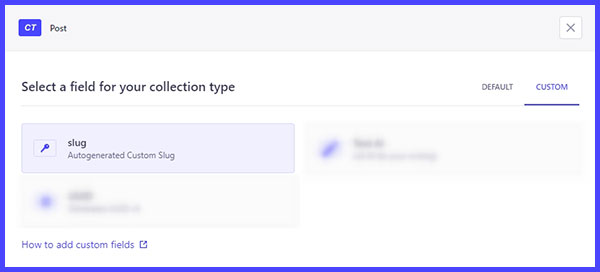

# Strapi plugin: slug
---
This plugin adds a Slug field to Strapi.
Slug has autocomplete default generated value in format: post-year-month-day-hours-minutes-seconds, same for all locales.

Also we can add KeyWord and/or pattern, which will be used to generate slug.

There are next patterns:

- keyword
- title + keyword
- id + keyword
- datetime + keyword
- title
- id
- datetime 

Id generated automatically after clicking on button Save. If you don't choose any KeyWord or Pattern it's autofill field with datetime placeholder.

## Instalation
Install the plugin in your Strapi project.
- npm i custom-slug | [npm](https://www.npmjs.com/package/custom-slug)
<!-- - in root folder cd config folder and touch plugins.js
  paste this: 

```
    module.exports = {
    // ...
    'slug': {
      enabled: true
    },
    //...
    }
``` -->
- npm run build > npm run develop
- go to admin > Content Type Builder > choose content type > click to button Add another field (to this collection type) > select tab CUSTOM > click on slug plugin tile > add name to field label > click on button finish > click on button save.
- go to tab Advanced settings and check it off Enable localization for this field to FALSE (if it is TRUE/checked plugin generate unique value for every entry for all locales)

[content-type-builder](http://localhost:1337/admin/plugins/content-type-builder/content-types/)


## Description
This is Slug Custom Field plugin which generate automatically rewritable values on entity creation, like: post-year-month-day-hours-minutes-seconds and saves the same value for all locales in slug.
      
- autocomplete autofill uniq default value by title, entry id, current datetime and/or key word 
- same slug value to all locales 
- rewritable data 
- pattern by placeholder

## Screenshots




## Demo
[watch](https://www.veed.io/embed/19187aa4-f152-4325-a50a-3fd62cec9eb4)


---

# Цель

Нужно автозаполняемое поле slug, сохраняющее одно и то же значение для всех локалей. Текущие настройки UID не позволяют сохранять одно и тоже значение для разных языков.

### Созданный плагин отображает поле CustomField Slug, которое:

- автозаполненное со сгенерированными по паттерну значениями
- редактируемое (вводимые значения с клавиатуры на уникальность не проверяются)
- сохраняет одно и то же значение для всех локалей - автогенерируемые значения уникальны
- автоподставляет значение из паттерна или если нажать переключатель - данные из поля title, если они присутствуют 

### Доступны следующие паттерны для генерации автозаполнения:

- kw (key word - ключевое слово)
- kw + title
- kw + id
- kw + datetime
- title
- id
- datetime
  
По умолчанию, стоит datetime в формате: год-месяц-число-час-минуты-секунды. Если не указывать kw, то будут значения из паттернов title, id, datetime или же, если не выбрано ни kw ни pattern, будет значение "datetime".  Поле по паттерну id автозаполняется после нажатия кнопки Сохранить в соответствующей коллекции Entry, это связано с спецификой Strapi, он присваивает значение ID, только после сохранения поста. 
Если включить чекбокс Enable localization, все значения будут уникальны и перегенерированны заново для каждой локали.

#### Slugify/URLize/генерация наименования ссылок:
Нашла, но не очень поняла, как Strapi конвертирует вводимые значения на кириллице в латиницу и убирает спец. символы.
[Например](https://github.com/strapi/strapi/blob/main/packages/core/admin/admin/src/content-manager/components/InputUID/index.js), тут отправляет запрос на /content-manager/uid/generate и получает ключ data с конвертированным значением. Не поняла, как достучаться до этого поля, чтоб были нужные значения, потому на Chat GPT сделала конвертер cyr-to-lat. 


### Похожие плагины:
- [URL alias](https://market.strapi.io/plugins/@strapi-community-strapi-plugin-url-alias)
- [Custom Links](https://market.strapi.io/plugins/strapi-plugin-custom-links)
- [UUID Field](https://market.strapi.io/plugins/@bn-digital-strapi-plugin-field-uuid)

### Доработки:
- убрать иконку и тайтл в админке в сайдбаре [ui]
- расположить в ряд поля с настройками плагина (Kw + Pattern) [ui]
- сделать проверку на уникальность/совпадения вводимых значений с клавиатуры [feature] 